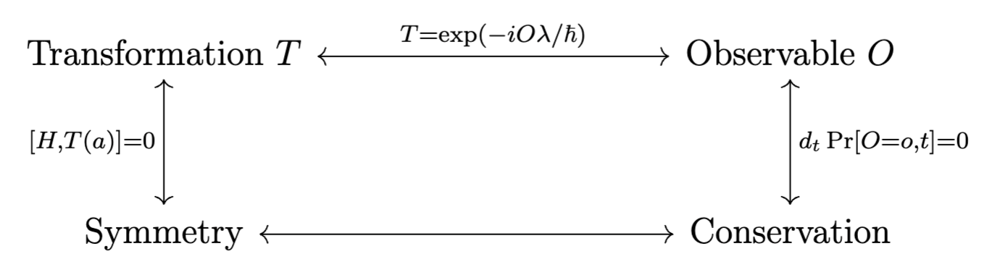

# Symmetry, Conservation Laws, and Selection Rules

## Operators in quantum theory

### Fundamental operators

The fundamental operators in quantum theory are \(x, p\) with

\[
(x\, \psi)(x) = x\psi(x), \quad (p\, \psi)(x) = -i\hbar \pd x
\]

They give rise to the canonical commutation relation

\[
[x, p] = i\hbar
\]

This commutation relation gives rise to vector operator's commutation relations. The momentum operator may be conveniently memorized as using \(-\pd x\) to effect translation in \(x\), using \(i\) to keep it skew-Hermitian, using \(\hbar\) for units.

### Ladder operators

For a harmonic oscillator Hamiltonian

\[
H = \frac{1}{2m} \left[p^2 + (m\omega x)^2\right]
\]

The raising and lowering operators of interest are

\[
a_\pm = \frac{1}{\sqrt{2\hbar m \omega}}\left(\mp i p + m\omega x\right)
\]

They are conjugates of each other and obey the commutation relations

\[
[a_-, a_+] = 1, \quad H = \hbar \omega \left(a_+a_- + \frac{1}{2}\right)
\]

We can in turn express \(x, p\) in terms of the ladder operators

\[
x = \sqrt{\frac{\hbar}{2m\omega}}(a_+ + a_-), \quad p = i \sqrt{\frac{\hbar m \omega}{2}}(a_+ - a_-)
\]

Number operator \(n\) is defined by \(n = a_+a_-\). We conveniently have (operator on left side)

\[
n\psi_n = n\psi_n, \quad a_+\psi_n = \sqrt{n+1}\psi_{n+1}, \quad a_-\psi_n = \sqrt{n} \psi_{n-1}
\]

## Vector operators
The fundamental commutation relations for vector operators are 
\[ 
    [V_x, V_y] = i\hb V_z; \quad [V_y, V_z] = i\hb V_x; \quad [V_z, V_x] = i\hb V_y 
\] 
We can define $V^2 = V_x^2 + V_y^2 + V_z^2$, then $[V, V^2]=0$. 
We can also define ladder operators 
\[ 
    V_\pm = V_x \pm i V_y 
\] 
They obey the commutation relations 
\[ 
    [V^2, V_\pm] = 0, \quad [V_z, V_\pm] = \pm \hb V_\pm
\] 
Fix an eigenspace of $L^2$ with eigenvalue $\hb^2l(l+1)$ with 
dimension $2l+1$, where $l$ can be an integer or half-integer.
In this eigenspace, 
\[ 
    V_z = \hb \begin{pmatrix}
        l \\ & l-1 \\ &&\ddots \\ &&&-l 
    \end{pmatrix}, \quad
    L_x = \df 1 2 (V_+ + V_-), \quad 
    L_y = \df i {2}(V_- - V_+)
\] 
Here the representations of $V_\pm$ are shifted diagonals of $\hb$. 

## Transformation

We first formally consider transformations acting on states.

::: {.definition name="translation operator"}
We define its action on \(\psi(x)\) as
\[
T(a)\psi(x) = \psi(x-a)
\]
This definition characterizes the action of \(T(a)\) on the positional representation of \(|\psi\rangle\). In terms of states themselves, the translation operator satisfy, for \(|\psi'\rangle = T(a)|\psi\rangle\)
\[
\langle \psi'|x\rangle = \langle \psi|x-a\rangle
\]
:::

::: {.definition name="parity operator"}
The parity-inverted state \(|\psi'\rangle = \Pi |\psi\rangle\) satisfies
\[
\langle \psi'|r\rangle = \langle \psi'|-r\rangle
\]
Here \(|r\rangle\) may be generally understood as a 3d positional basis. Represented spherically:
\[
\Pi \psi(r, \theta, \phi) = \psi(r, \pi - \theta, \phi + \pi)
\]
:::

::: {.proposition}
For hydrogenic orbitals, 
\[
\Pi \psi_{nlm}(r, \theta, \phi) = (-1)^l\psi_{nlm}(r, \theta, \phi)
\]
We only need consider the angular part. Recall
\[
Y_l^m(\theta, \phi) \propto P_l^m(\cos\theta)\exp(im\phi)
\]
and \(\cos(\pi - \theta) = -\cos\theta\).
:::

::: {.definition name="z-rotation operator"}
The rotation operator which effects counterclockwise rotation about the \(z\)-axis by \(\varphi\) is
\[
R_z(\varphi)\psi(r, \theta, \phi) = \psi(r, \theta, \phi - \varphi)
\]
:::

Transformations, since they map states to states, must be unitary. 
They are effectively a basis permutation. For example, translation effects the 
basis change $|x\ra \mapsto |x-a\ra$. One may view this via the equivalence between 
sliding our state to the right, and sliding the spatial axis to the left while 
following the center of the axis. By unitarity $T^\dag = T^{-1}$. 

Apart from considering the effect of $T$ on $|\psi\ra$,
define its application on an operator $O$ such that expectation values of 
$O$ w.r.t. $T|\psi\ra$ agrees with that of $T(O)$ w.r.t. $|\psi\ra$. This motivates 
the following definition. 

::: {.definition name="operator transformation, invariance"}
The effect of transforming operator \(O\) by \(T\) is
\[
T(O) = T^\dag O T = T^{-1}OT
\]
It follows that \(O\) is invariant under \(T\) if \([O, T] = 0\).
\begin{equation}
    \langle \psi|T^\dag OT|\psi\rangle = \langle \psi|T(O)|\psi\rangle \implies T(O) = T^\dag OT
\end{equation}
:::

## Observables and transformations

_Appendum from 2024.5: study Lie groups and Lie algebra!_

Recall that \(p = -i\hbar \pd x\). Assuming that \(\psi(x)\) may be expanded as a power-series.

\begin{equation}
\begin{aligned}
    T(a)\psi(x) &= \psi(x-a) = \sum_{n=0}^\infty \frac{(-a)^n}{n!}\pd x^n\psi(x)  \\ 
                &= \sum \frac{1}{n!} \left(\frac{-ia}{\hbar}(-i\hbar\pd x)\right)^n \psi(x)
\end{aligned}
(\#eq:momentumAsExponential)
\end{equation}

::: {.definition name="exponential of an operator"}
We define the exponential of a Hermitian operator as a power-series, with multiplication denoting composition
\begin{equation}
    \exp\left(\alpha O\right) = \sum_{n=0}^\infty \frac{1}{n!} (\alpha O)^n
\end{equation}
This definition is made precise by the formulation of Lie group and Lie algebra, its main property of interest is
\begin{equation}
    \pd \alpha \exp(\alpha O) = \alpha \exp(\alpha O)
\end{equation}
:::

::: {.definition name="observables generate transformation"}
We say that a Hermitian observable \(O\) generates a one-parameter family of transformations \(T(a), a \in \mathbb{R}\) if
\begin{equation}
    T(a) = \exp\left(-\frac{i a}{\hbar} O\right)
\end{equation}
:::

Equation \@ref(eq:momentumAsExponential) shows that momentum generates axial translation.

::: {.remark}
Equation \@ref(eq:hermitianExponential) provides another perspective: each Hermitian \(Q\) defines an infinitesimal transformation \((1 + ia Q/N)\) when \(N \to \infty\). This operator is unitary up to a quadratic order:
\begin{equation}
    \left(1 + ia Q/N\right)^\dag \left(1 + ia Q/N\right) = 1 + O(1/N^2)
    (\#eq:hermitianExponential)
\end{equation}
The cumulative action of applying \((1 + ia O/N)\) for \(N\) times is \(\exp(ia Q)\).
:::

::: {.theorem name="Hamiltonian generates time translation"}
\(\exp\left(-i H t/\hbar\right)|t_0\rangle = |t_0-t\rangle\)
:::
_Proof:_ this statement is equivalent to Schrödinger's equation.
\[
\pd t|\psi\rangle = -\frac{i}{\hbar} H|\psi\rangle
\]

::: {.definition name="complete set of compatible observables (CSCO)"}
A set of Hermitian observables \(\{O_j\}\) over a Hilbert space is compatible if they pairwise commute, and complete if for every set of eigenspaces \(\{\mathcal S_{O_j, \lambda_k}\}\), their intersection has dimension at most \(1\).
(\#def:csco)
:::

::: {.example name="CSCO for central potential"}
For any Hamiltonian \(H\) which commutes with \(L\), the set \(H, L_z, L^2\) is a complete set of compatible observables. They pairwise commute and \(E_n, l, m\) uniquely determine an eigenstate.
:::

## Summary
The key idea of this section is the following diagram

  

A system is defined by its time-evolution, which is defined by its Hamiltonian. We first establish the connection between transformation and symmetry.

::: {.definition name="continuous symmetry"}
A system with Hamiltonian \(H\) has continuous symmetry with respect to a family of transformations \(T(a)\), parameterized by \(a \in \mathbb{R}\), if
\[
\forall a \in \mathbb{R}, [H, T(a)] = 0
\]
:::

Transformations biject with observables, up to a constant factor. We show that continuous symmetry is equivalent to the conservation of an observable.

::: {.theorem name="conservation is equivalent to commutativity"}
The probability distribution for observing different values of a Hermitian \(O\) is conserved if and only if \([H, O] = 0\).
:::
_Proof:_ Suppose \([H, O] = 0\), then the energy eigenstates \(|n\rangle\) are also eigenstates of \(O\).
\[
|\psi_0\rangle = \sum c_n |n\rangle \implies \Pr[O=o_n, t=0] = |c_n|^2
\]
Under time evolution, the probability distribution is unchanged
\[
|\psi_t\rangle = \sum \exp\left(iE_n t/\hbar\right) c_n |n\rangle \implies \Pr[O=o_n, t] = |\exp\left(iE_n t/\hbar\right) c_n|^2 = |c_n|^2
\]
Conversely, distribution conservation in particular implies \(\langle O \rangle = 0\) (Ehrenfest's theorem):
\[
\begin{aligned}
d_t\langle O \rangle &= d_t\langle \psi|O|\psi \rangle \\
&= \left(d_t|\psi \rangle\right)^\dagger O|\psi \rangle + \left(O|\psi \rangle\right)^\dagger d_t|\psi \rangle + \partial t O \\
&= \frac{i}{\hbar} \langle [H, O] \rangle
\end{aligned}
\]
The expectation value vanishes for all \(|\psi \rangle\), so \([H, O] = 0\).

::: {.theorem #conservationSymmetryEquivalence name="continuous symmetry-conservation equivalence"}
For a Hermitian \(O\), the probability distribution for observing different values of \(O\)
is conserved if and only if \(H\) has continuous symmetry with respect to the family of transformations
generated by \(O\)
\[
T(a) = \exp(-ia O / \hbar)
\]
:::

_Proof:_ \([H, \exp(-i aO/\hbar)] \iff [H, O] = 0\). Think in the eigenbasis throughout.

::: {.remark}
The previous theorem emphasizes the fundamental stochasticity
of quantum mechanics. The true quantum-mechanical counterpart of classical values are not the
measured values (which are not conserved), but its distribution.
:::

## Selection rules

Recall that commutativity ensures a simultaneous set of eigenvectors. This constitutes the most
basic idea of a selection rule. We recall a result from linear algebra:

::: {.theorem name="commutativity is equivalent to shared eigenbasis"}
Two normal operators \(A, B\) commute if and only if they share an eigenbasis.

_Proof:_ Let \(v\) be an eigenvector of \(A\) with eigenvalue \(\lambda\), then
\[
ABv = BAv = \lambda B v
\]
This means \(Bv\) is in the eigenspace of \(A\) with eigenvalue \(\lambda\).
Then \(B\) maps eigenspaces of \(A\) onto themselves.
Apply the spectral theorem in each eigenspace.
:::

Selection rules constrain the matrix elements of an operator based on commutativity.

::: {.theorem name="Laporte's rule"}
Matrix elements of an operator that is odd under parity are nonzero only
for states with the same parity. Those for operators invariant under parity
are nonzero only for states with different parity.
:::
_Proof:_ Consider an operator \(O\) such that \(\{O, \Pi\} = 0\) and states \(|n\rangle, |m\rangle\) with
parity
\[
\Pi |n\rangle = p_n|n\rangle, \quad \Pi |m\rangle = p_m|m\rangle, \quad p_n, p_m \in \{-1, 1\}
\]
Consider the matrix element
\[
\begin{aligned}
    \langle n|O|m \rangle &= -\langle n|\Pi^\dag O \Pi|m \rangle \\
        &= -p_mp_n \langle n|O|m \rangle
\end{aligned}
\]
Rearranging the equation \(\langle n|O|m \rangle (1+p_mp_n) = 0\) implies that states with the same parity
(\(p_mp_n=1\)) have vanishing matrix elements. The argument proceeds similarly for \([O, \Pi] = 0\).

::: {.remark}
One informal way to remember Laporte's rule is that the matrix elements of \(O\) give the transition matrix when \(O\) happens to be the Hamiltonian. For a system which cares about parity, only states which have the same parity can evolve into each other.
:::

::: {.definition name="vector operator"}
Let \(R_n(\theta)\) correspond to the transformation of rotating about \(n\) by \(\theta\), it has a \(3\times 3\) matrix representation \(D_n(\theta)\). A 3-component vector operator \(V\) is a vector operator if for all \(n, \theta\)
\[
R_n^\dag(\theta) V R_n(\theta) = D_n(\theta)V
\]
In other words, the operator transforms spatially. This is equivalent to if \(V\) satisfies
\[
[L_i, V_j] = i\hbar \epsilon_{ijk} V_k
\]
:::
Examples of three such vectors are \(r, p, L\).

::: {.theorem name="rotational selection rules for scalars"}
A rank-\(1\) operator \(f\) satisfying
\[
[L_z, f] = [L_\pm, f] = [L^2, f] = 0
\]
has matrix elements of the form
\[
\langle n', l', m'|f|n, l, m \rangle = \delta_{nn'}\delta_{ll'}\langle n',l\, \|\, f\, \|\, n, l \rangle
\]
:::
